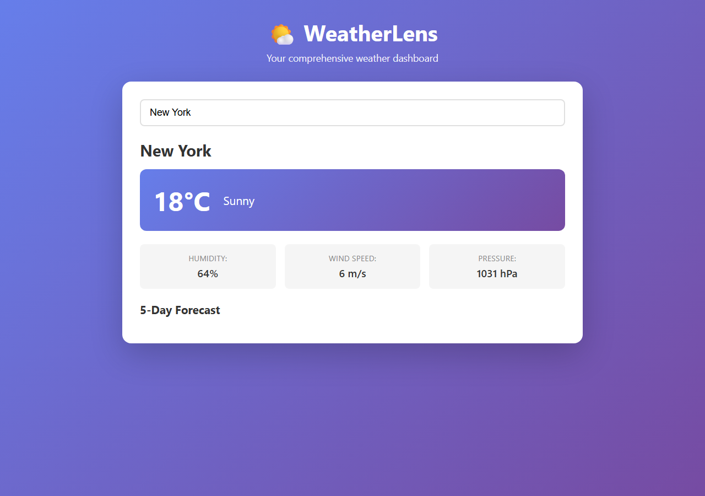
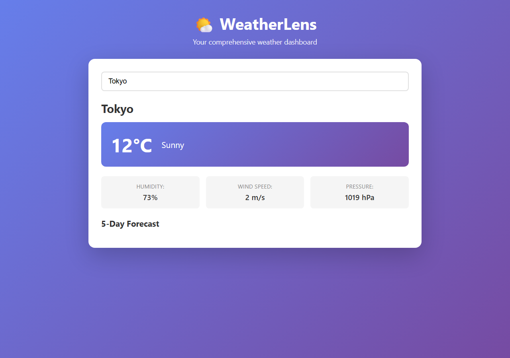
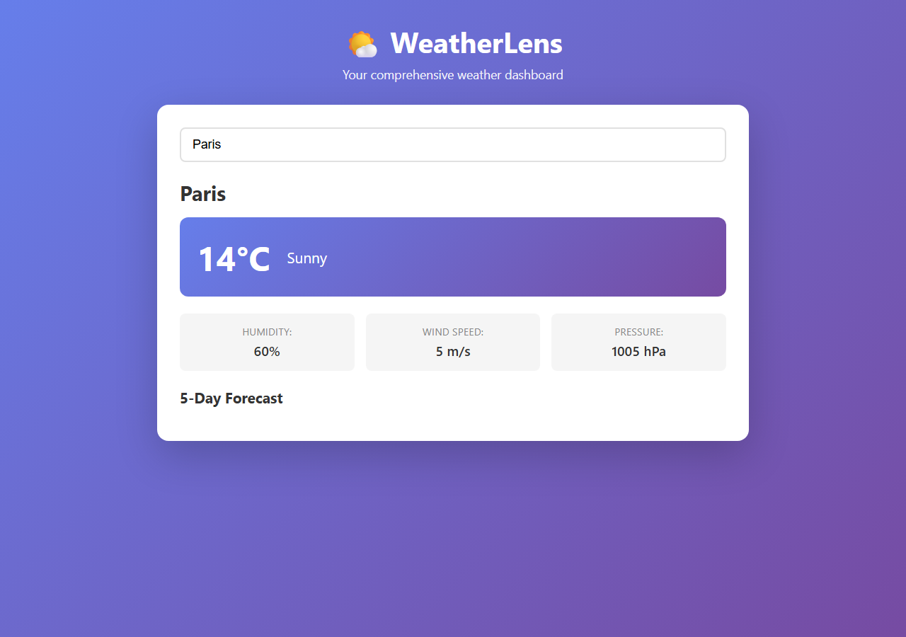
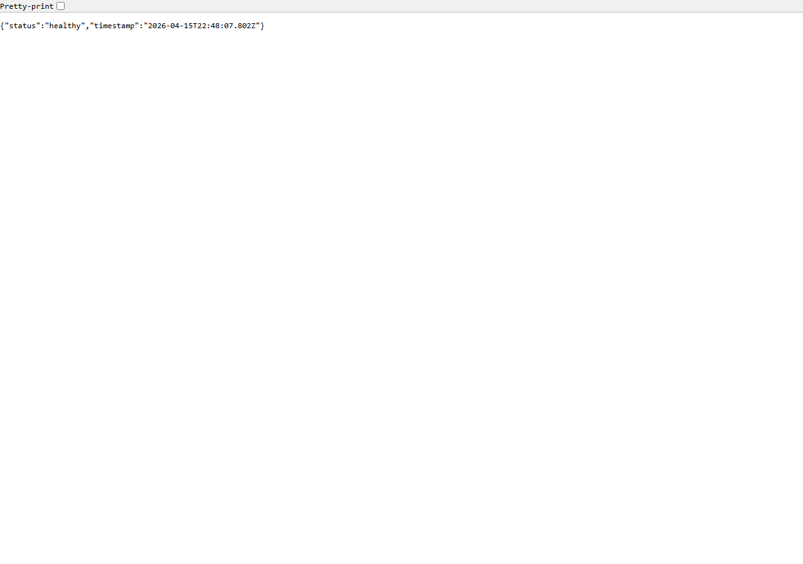

# Ralph Automation

## Overview

This lab teaches you how to configure Ralph — SQUAD's autonomous coordinator agent — for continuous work monitoring, idle-watch, and automated backlog processing. Ralph watches for idle periods, monitors team health, processes backlog items autonomously, and escalates blockers. This demonstrates the "always-on" agentic development model where Ralph keeps the development pipeline flowing even when humans aren't actively managing it.

**Business Domain:** Open-source weather dashboard project for "WeatherLens"

## Learning Objectives

By completing this lab, you will:
- Configure Ralph's work schedules and idle-watch triggers
- Define task type handlers for different backlog item categories
- Set up escalation rules with human oversight checkpoints
- Monitor Ralph's activity through logs and reports
- Balance automation autonomy with human control

## Prerequisites

- Completed "Getting Started with SQUAD" lab
- GitHub Actions experience
- React and Node.js familiarity
- Understanding of CI/CD pipelines

## Architecture

The WeatherLens project is a React + Node.js weather dashboard with a healthy backlog of 20+ issues. Ralph is configured to autonomously process these items based on task type, priority, and risk level.

The WeatherLens dashboard uses a purple gradient UI, displaying current weather conditions (temperature, humidity, wind speed, pressure) and a 5-day forecast for any searched city. The backend serves mock data by default and can optionally connect to the OpenWeatherMap API.

Here is the homepage showing the default city (London) with current conditions and forecast:


The search feature works across multiple cities. Below are examples for New York, Tokyo, and Paris:







The backend exposes a health endpoint confirming API server status:



### Ralph Configuration Components

1. **Work Schedules** - When Ralph should be active
2. **Idle Watch** - Auto-start when pipeline is idle for 6+ hours
3. **Task Handlers** - How to process each issue type
4. **Escalation Rules** - When to notify humans
5. **Activity Logging** - Track Ralph's autonomous work

---

## Lab Instructions (CLI Walkthrough)

> **Tools Used:** [Squad CLI](https://www.npmjs.com/package/@bradygaster/squad-cli) (`npx @bradygaster/squad-cli`) and [GitHub Copilot CLI](https://docs.github.com/copilot) (`gh copilot`).
>
> All code changes below are performed by the CLI tools, not manually. The `solution-final` branch and tags contain the complete results.

---

### Step 1: Review Backlog & Run App

**Objective:** Run the WeatherLens app and examine the 20 backlog items.

```powershell
# Install and start backend
cd backend && npm install && npm run dev
# Output: WeatherLens API running on port 3000

# Install and start frontend (new terminal)
cd frontend && npm install && npm run dev
# Output: VITE v6.4.2 ready — http://localhost:5199/
```

Review `docs/BACKLOG.md` — 20 issues across 6 categories:

| Category           | Issues | Priority | Ralph Can Handle? |
|--------------------|--------|----------|-------------------|
| Dependency updates | #1–5   | High     | ✅ Autonomous      |
| Bug fixes          | #6–8   | Medium   | ⚠️ Needs review    |
| Documentation      | #9–12  | Medium   | ✅ Delegate to Mouth |
| Performance        | #13–14 | Low      | ⚠️ Architecture review |
| Features           | #15–17 | Low      | ❌ Human required  |
| Maintenance        | #18–20 | Low      | ✅ Autonomous      |

```powershell
git add -A && git commit -m "Step 01: Review backlog and run app"
git tag step-01-review-backlog
```

---

### Step 2: Initialize Squad & Configure Ralph

**Objective:** Scaffold the Squad workspace and enhance Ralph's config.

```powershell
# Initialize Squad on this repo
npx @bradygaster/squad-cli init
```

**Output:**
```
✓ .squad\config.json
✓ .squad\agents\scribe\charter.md
✓ .squad\agents\ralph\charter.md
✓ .squad\identity\now.md
✓ .squad\identity\wisdom.md
✓ .squad\ceremonies.md
✓ .github\agents\squad.agent.md
✓ .github\workflows\squad-heartbeat.yml
✓ .github\workflows\squad-issue-assign.yml
✓ .github\workflows\squad-triage.yml
✓ .copilot\mcp-config.json
✓ .copilot/skills (30+ skills installed)

◆ SQUAD — Your team is ready. Run squad to start.
```

```powershell
# Configure Ralph for 24/7 autonomous monitoring
gh copilot -- -p "Configure Ralph for autonomous work monitoring on this \
  WeatherLens project. Enhance .squad/agents/ralph/config.yml with: \
  1) work schedules set to 24/7 UTC, \
  2) idle-watch with 6-hour threshold, \
  3) task handlers for dependency updates (auto-approve), bug fixes \
     (needs review, delegate to hands), documentation (delegate to mouth), \
     performance (architecture review, delegate to brain), feature requests \
     (human approval), maintenance (auto-approve), \
  4) max concurrent tasks=3, max PRs/day=5." \
  --allow-all-tools --yolo
```

**Result:** Enhanced `config.yml` (+120 lines) with 6 sections:
- Schedule: 24/7 UTC mode
- Idle Watch: 6h threshold, `0 */6 * * *` cron
- Task Handlers: 6 types with descriptions, labels, review policies, retry settings
- Limits: 3 concurrent tasks, 5 PRs/day, 10-min cooldown
- Safety: `ralph/` branch prefix, protected branches, forbidden paths
- Notifications: PR created, escalation, failure, daily summary

```powershell
git tag step-02-configure-ralph
```

---

### Step 3: Define Task Handlers

**Objective:** Create detailed task handler definitions with backlog mapping.

```powershell
gh copilot -- -p "Create task handler configurations for Ralph in \
  .squad/agents/ralph/task-handlers.yml. Define how to process each \
  issue type: dependency-update (auto-approve), bug-fix (delegate to \
  Hands, review by Eyes), documentation (delegate to Mouth), performance \
  (architecture review by Brain), feature-request (human approval gate), \
  maintenance (auto-approve). Map all 20 backlog items to handlers. \
  Include branch naming (ralph/<type>/<issue>), PR templates, retry \
  policies, and a 6-wave processing order." \
  --allow-all-tools --yolo
```

**Result:** Created `task-handlers.yml` (659 lines) with:

| Handler           | Auto-Approve | Delegate | Reviewer | Gate           |
|-------------------|-------------|----------|----------|----------------|
| dependency-update | ✅           | —        | —        | —              |
| bug-fix           | ❌           | Hands    | Eyes     | —              |
| documentation     | ✅           | Mouth    | —        | —              |
| performance       | ❌           | Brain    | Eyes     | Arch review    |
| feature-request   | ❌           | Hands    | Eyes     | Human approval |
| maintenance       | ✅           | —        | —        | —              |

6-wave processing order: Security → Docs → Bugs → Maintenance → Performance → Features

```powershell
git tag step-03-task-handlers
```

---

### Step 4: Set Up Idle-Watch

**Objective:** Configure auto-start when pipeline is idle for 6+ hours.

```powershell
gh copilot -- -p "Configure Ralph idle-watch in \
  .squad/agents/ralph/idle-watch.yml. Define: \
  1) idle detection after 6h of inactivity, \
  2) check interval cron '0 */6 * * *', \
  3) notification via GitHub issue comments with work plan summary, \
  4) escalation after 24h unattended, \
  5) activity sources (commits, PRs, issues, deployments), \
  6) 2-hour cool-down after each run." \
  --allow-all-tools --yolo
```

**Result:** Created `idle-watch.yml` (193 lines) with:
- Idle detection: 6h threshold across all activity sources
- Check interval: Every 6 hours UTC (00:00, 06:00, 12:00, 18:00)
- Notifications: GitHub issue comments with Jinja templates
- Escalation: Summary issue after 24h unattended
- Cool-down: 2-hour pause between runs

```powershell
git tag step-04-idle-watch
```

---

### Step 5: Set Up Escalation Rules

**Objective:** Convert escalation rules to structured YAML with severity levels.

```powershell
gh copilot -- -p "Enhance .squad/agents/ralph/escalation.yml. Convert \
  from markdown to proper YAML with: \
  1) severity levels (critical/high/medium/low) with specific triggers, \
  2) WeatherLens mappings: DB=critical, API breaking=critical, \
     security=high, build failures after 2 retries=high, \
     ambiguous reqs=medium, large diffs=medium, features=low, \
  3) notification channels per severity, \
  4) response timeouts: 1h/4h/24h/72h, \
  5) auto-actions on timeout: reminder→pause→escalate, \
  6) backlog references: #8, #13-17, #19." \
  --allow-all-tools --yolo
```

**Result:** Converted `escalation.yml` (+193 -48 lines) with:
- 4 severity levels with parseable trigger conditions
- Notification channels: critical→issue+@team, high→issue+assignee, medium→PR comment, low→label
- Response timeouts: 1h / 4h / 24h / 72h
- 3 ordered timeout auto-actions
- Backlog cross-reference mapping #8, #13–17, #19

```powershell
git tag step-05-escalation-rules
```

---

### Step 6: Run Ralph Loop

**Objective:** Start Ralph and observe backlog scanning.

```powershell
# Add team members to .squad/team.md first
gh copilot -- -p "Add Ralph, Hands, Eyes, Mouth, Brain as squad members \
  in .squad/team.md with appropriate roles and statuses." \
  --allow-all-tools --yolo

# Run Ralph triage (watch mode)
npx @bradygaster/squad-cli triage
```

**Output:**
```
🔄 Ralph — Watch Mode
Polling every 10 minute(s) for squad work. Ctrl+C to stop.
📋 Board is clear — Ralph is idling
```

```powershell
# Run Ralph loop
npx @bradygaster/squad-cli loop
```

**Output:**
```
🔄 Squad loop starting... (full implementation pending)
   Interval: 10 minutes
```

Ralph enters watch mode and polls for GitHub issues. The board is clear until backlog items are created as GitHub Issues with labels matching the task handlers.

```powershell
git tag step-06-run-ralph-loop
```

---

### Step 7: Activity Logging & Monitoring

**Objective:** Check Ralph's status, token usage, and system health.

```powershell
# Check token usage
npx @bradygaster/squad-cli cost
```

**Output:**
```
💰 No token usage data found in orchestration logs.
   Token tracking is recorded when agents report usage in their responses.
```

```powershell
# Check squad status
npx @bradygaster/squad-cli status
```

**Output:**
```
Squad Status
  Active squad: repo
  Path:         .squad
  Reason:       Found .squad/ in repository tree
```

```powershell
# Run health check
npx @bradygaster/squad-cli doctor
```

**Output:**
```
🩺 Squad Doctor
═══════════════
✅  .squad/ directory exists
✅  config.json valid — parses as JSON, schema OK
✅  team.md found with ## Members header
✅  routing.md found
✅  agents/ directory exists (2 agents)
❌  casting/registry.json exists — file not found
✅  decisions.md exists
✅  Node.js ≥22.5.0 — node:sqlite available

Summary: 7 passed, 1 failed, 2 warnings
```

```powershell
# Create monitoring guide
gh copilot -- -p "Create a monitoring guide at \
  .squad/agents/ralph/monitoring.md covering daily/weekly checklists, \
  CLI commands, and health check interpretation." \
  --allow-all-tools --yolo

git tag step-07-activity-logging
```

---

### Step 8: Retrospective

**Objective:** Review Ralph's configuration and generate readiness summary.

```powershell
gh copilot -- -p "Generate a retrospective summary at \
  .squad/agents/ralph/retrospective.md. Review all Ralph config files \
  and docs/BACKLOG.md. Include: what was configured, readiness assessment, \
  risk analysis, metrics baseline, next steps, lessons learned." \
  --allow-all-tools --yolo
```

**Result:** Created `retrospective.md` (204 lines) with:
- **Readiness:** 11 items autonomous (55%), 4 need review (20%), 5 blocked (25%)
- **Metrics baseline:** 71% success rate (target ≥80%), ~10–15 PRs in week 1
- **Next steps:** 15 action items (create GitHub Issues, enable workflows, monitor)
- **Lessons learned:** 10 key decisions with rationale

```powershell
git tag step-08-retrospective
```

---

### Push Solution

```powershell
git push origin solution-final --tags
```

All 8 tags pushed:
- `step-01-review-backlog` through `step-08-retrospective`

## Key Concepts

### Autonomous vs Supervised

| Mode | When to Use | Example |
|------|------------|---------|
| **Autonomous** | Safe, repeatable tasks | Dependency updates, docs |
| **Supervised** | Changes requiring judgment | Bug fixes, features |
| **Human-Only** | Strategic decisions | Architecture changes |

### Task Handler Patterns

**Pattern 1: Fully Autonomous**
```yaml
dependency-update:
  auto_approve: true
  actions: [update, test, create-pr, merge]
```

**Pattern 2: Delegate + Review**
```yaml
bug-fix:
  auto_approve: false
  actions: [delegate-to: hands, request-review: eyes]
```

**Pattern 3: Plan + Approve**
```yaml
feature:
  auto_approve: false
  actions: [create-plan, get-human-approval]
```

### Idle-Watch Strategy

Ralph optimizes team productivity by:
1. Detecting idle periods (no commits for X hours)
2. Processing low-risk backlog items
3. Creating PRs for review when team returns
4. Preventing backlog accumulation

## Success Criteria

✅ WeatherLens runs with all existing features  
✅ 20+ issues pre-loaded covering various task types  
✅ Ralph configuration defines work schedules and task handlers  
✅ Idle-watch triggers Ralph when pipeline is idle  
✅ Ralph processes at least 5 backlog items autonomously  
✅ Escalation rules notify humans for critical changes  
✅ Ralph activity log tracks all actions taken  

## Resources

- [SQUAD Ralph Documentation](https://squad.dev/docs/ralph)
- [GitHub Actions Scheduled Workflows](https://docs.github.com/actions/using-workflows/events-that-trigger-workflows#schedule)
- [Autonomous Agent Best Practices](https://squad.dev/docs/autonomous-agents)

## Troubleshooting

**Issue:** Ralph not processing any tasks  
**Solution:** Check idle threshold - may need to lower from 6 hours

**Issue:** Ralph creates too many PRs  
**Solution:** Reduce max_prs_per_day in config

**Issue:** Ralph isn't escalating risky changes  
**Solution:** Review and expand escalation triggers in escalation.yml

---

**Estimated Duration:** 3-4 hours  
**Difficulty:** Intermediate  
**Category:** Agentic Software Development
